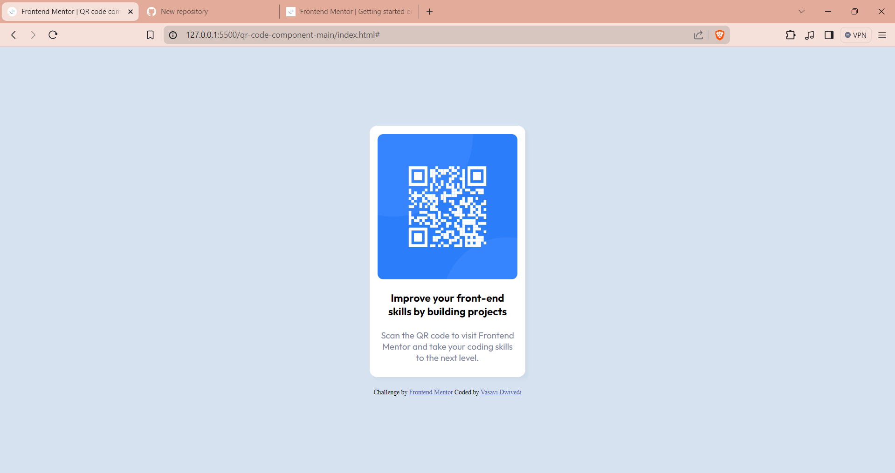

# Frontend Mentor - QR code component solution

This is a solution to the [QR code component challenge on Frontend Mentor](https://www.frontendmentor.io/challenges/qr-code-component-iux_sIO_H). Frontend Mentor challenges help you improve your coding skills by building realistic projects. 

## Table of contents

- [Overview](#overview)
  -[screenshot](#screenshot)
  -[links](#links)
-  [my process](my-process)
  - [Built with](#built-with)
  - [What I learned](#what-i-learned)
  - [Continued development](#continued-development)
  - [Useful resources](#useful-resources)
- [Author](#author)
- [Acknowledgments](#acknowledgments)

## Overview
This is a very basic,beginner's project made by using only css and html.I was provided some css style cues and qr code image,the rest I had to build myself.

### Screenshot

### Links

- Solution URL: [Add solution URL here](https://your-solution-url.com)
- Live Site URL: [Add live site URL here](https://your-live-site-url.com)

## My process
I began by first linking the css file and the qr code images.After that I created the body and html tag and used it to choose the background colour and dimensions etc.Then I gave classes and ids to the elements to facilitate the creation of a flexbox to contain the image and texts.Then I styled all of it a bit more according to the reference I was provided and then finally i completed the project.

### Built with

- Semantic HTML5 markup
- CSS custom properties
- Flexbox
- CSS Grid
- Mobile-first workflow

### What I learned

Although this may be a simple and easy project project but it was quite the task for me as a beginner. I learned various new styling tricks and techniques.
For an instance, the flexbox part helped me understand the core basics even more thoroughly.
In short,this project helped me grasp how to actually use styles and put my newly learned skills to work.

### Continued development

As for now, I'd like to work more on my flexbox skills and develop an even deeper understanding of it.

## Acknowledgments

Having no mentors in the cs field, I completed this project majorly by myself. Whenever i was stuck on a certain piece of code I would search the internet for solutions to questions posted by people who were also stuck similarly before me.

[def]: HTML,CSS